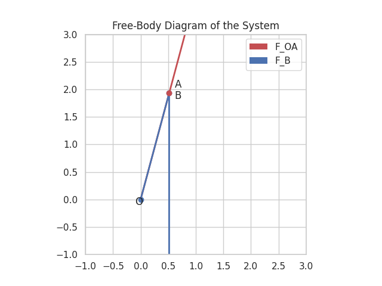
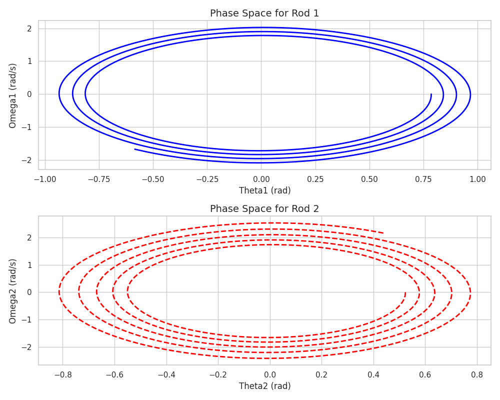

# Double Pendulum Simulation

This project simulates the dynamics of a double pendulum system. The simulation models the displacement, velocity, and acceleration of each pendulum rod over time. It also visualizes the forces acting on the system, the free-body diagram, and the phase space. An animation of the double pendulum's motion is also provided.

## Table of Contents

- [Project Overview](#project-overview)
- [Installation](#installation)
- [Usage](#usage)
- [Algorithm Explanation](#algorithm-explanation)
- [Parameters and Variables](#parameters-and-variables)
- [Example Output](#example-output)
- [Generated Outputs](#generated-outputs)
- [Contributing](#contributing)
- [License](#license)

## Project Overview

The goal of this project is to model and simulate the performance of a double pendulum system. The simulation uses Euler's method to integrate the equations of motion and visualizes the results.

## Installation

To run this project, you need Python 3.x along with the following libraries:
- `numpy`
- `matplotlib`
- `seaborn`

You can install these libraries using pip:

```bash
pip install numpy matplotlib seaborn
```

### Clone the Repository

Clone the repository using Git:

```bash
git clone https://github.com/esmail-sarhadi/Double-Pendulum-Simulation.git
cd double-pendulum-simulation
```

## Usage

Run the script directly in a Python environment to perform the simulation and plot the results:

```bash
python double_pendulum_simulation.py
```

The script will simulate the double pendulum dynamics and produce several plots and an animation.

## Algorithm Explanation

The simulation solves a set of differential equations that model the double pendulum dynamics using Euler's method. The main equations determine the angular acceleration of each rod based on the current angles and angular velocities.

### Differential Equations

The primary equations of motion used are:
\[ \alpha_1 = -\frac{g}{L1} \sin(\theta_1) \]
\[ \alpha_2 = -\frac{g}{L2} \sin(\theta_2) \]

where:
- \(\theta_1\) and \(\theta_2\) are the angles of the first and second rods, respectively.
- \(\omega_1\) and \(\omega_2\) are the angular velocities.
- \(\alpha_1\) and \(\alpha_2\) are the angular accelerations.
- \(g\) is the gravitational acceleration.
- \(L1\) and \(L2\) are the lengths of the rods.

## Parameters and Variables

- **m1**: Mass of the first object (kg)
- **m2**: Mass of the second object (kg)
- **L1**: Length of the first rod (m)
- **L2**: Length of the second rod (m)
- **g**: Gravitational acceleration (m/s^2)
- **theta1**: Initial angle of the first rod (radians)
- **theta2**: Initial angle of the second rod (radians)
- **omega1**: Initial angular velocity of the first rod (rad/s)
- **omega2**: Initial angular velocity of the second rod (rad/s)
- **t_max**: Total simulation time (s)
- **dt**: Time step (s)

## Example Output

The script produces plots showing the following variables over time for the double pendulum system:
- Displacement
- Velocity
- Acceleration
- Tensions
- Gravitational Forces
- Phase Space

Additionally, it generates an animation of the double pendulum's motion and a free-body diagram of the system.

## Generated Outputs

### Displacement, Velocity, and Acceleration


### Free-Body Diagram


### Forces Acting on the System


### Phase Space


### Animation
[Animation (MP4)](animation.mp4)

## Contributing

Contributions are welcome! If you have suggestions for improvements or features, please fork the repository and create a pull request. 

## License

This project is licensed under the MIT License. See the [LICENSE](LICENSE) file for details.

<a href="https://nowpayments.io/donation?api_key=REWCYVC-A1AMFK3-QNRS663-PKJSBD2&source=lk_donation&medium=referral" target="_blank">
     
    </a>
